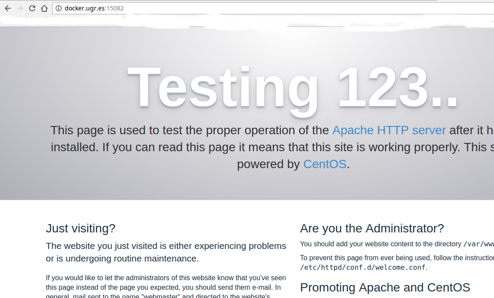

# Cloud computing

## Servicios y aplicaciones


### Práctica 1 IaaS - Despliegue de MVs y aplicaciones web

> Autor: Juan Pablo González Casado

> Email: pablo12614@correo.ugr.es

> Descripción: Desplegar dos máquinas virtuales en OpenNebula e implementar una aplicación web en la que el servidor web se encuentre en una máquina y el sistema gestor de base de datos en la otra.
La aplicación debe contener la gestión de la base de datos.

## Configuración previa de OpenNebula

La primera vez que utilizamos OpenNebula es necesario realizar unos pasos indicados en los tutoriales de la asignatura.

1. Conexión por medio de ssh
```
ssh mcc154722800@docker.ugr.es
//contraseña=CC.2017pw
```
2. Información de autenticación
```
oneuser login mcc15472800 --ssh --force
more .one/one_auth
```
Con esto obtendremos una clave para poder iniciar sesión en el navegador web en la interfaz gráfica de OpenNebula
*[mcc15472800:(contraseñagenerada)]*

Entrando en el navegador en dirección *docker.ugr.es:9869* e introduciendo los datos anteriomente obtenidos ya tendremos acceso.

## Configuración MV.1 (Servidor web)

La primera máquina va a ser creada con el objetivo de hacer de servidor web.

Para crearla se han seguido los siguientes pasos:

1. Nos conectamos a OpenNebula por medio de SSH.
2. Creamos la plantilla:

  `
  onetemplate create --name "CentOS-7-Webserver" --cpu 1 --vcpu 1 --memory 1024 --arch x86_64 --disk 19 --nic 212 --vnc --ssh --net_context
  ID: 630
  `
3. Obtenemos el ID 630
4. Instanciamos la plantilla:

  `
  onetemplate instantiate 630
  `
5. La anterior instrucción nos devolverá el ID de la máquina virtual:

  `
  VM ID: 766
  `

6. Comprobamos que se ha creado y el estado:

  `
  onevm list
  `

  Nos devolverá lo siguiente (el estado puede variar):

  `
  766 mcc15472 users    CentOS-7-Webser runn    0      0K noded02      0d 00h06
  `

  Aquí podemos ver como se ha creado, su ID, el nombre y el estado (running)

7. Ahora consultamos la IP de la máquina virtual para poder conectarnos a ella por SSH.

  `
  onevm show 766
  `

  Buscando ETH0_IP podremos ver la IP. En el caso de esta máquina es la 192.168.10.82

8. Conectamos con la máquina virtual

  `
  ssh root@192.168.10.82
  `
9. Actualizamos yum y reiniciamos

  `
  yum -y update
  `

  `
  reboot
  `

#### Instalación de servidor web

Ya estamos listos para configurar nuestra máquina virtual como servidor web.

El servidor web elegido es Apache por la facilidad para instalar y la gran documentación que hay sobre las posibles configuraciones que puedan ser necesarias.

Para la instalación se ha seguido un manual de DigitalOcean  https://www.digitalocean.com/community/tutorials/how-to-install-linux-apache-mysql-php-lamp-stack-on-centos-7

```
sudo yum install httpd
sudo systemctl start httpd.service
sudo systemctl enable httpd.service
```
Ejecutando las lineas anteriores tendremos un servidor apache instalado, iniciado y con inicio automático cada vez que se arranque el sistema.

Ahora solo nos queda instalar PHP para nuestra aplicación web:

```
sudo yum install php php-mysql
sudo systemctl restart httpd.service
```
Podemos comprobar que PHP funciona creando un archivo info

`sudo vi /var/www/html/info.php`

Con contenido:
  `<?php phpinfo(); ?>`

Y accediendo a *http://docker.ugr.es:15082/info.php* podremos ver la información de PHP.

Se ha instalado *git* como herramienta para gestionar los archivos que van a componer la aplicación web y que estará alojada en /var/www/http/

Clonando el repositorio y moviendo el directorio Practica1 al directorio donde se alojan las webs por defecto en apache:

`git clone https://github.com/Pablo126/CC2.git`

`mv -R /dondeeste/Practica1/ /var/www/http/`

Para comprobar que el servidor web funciona correctamente podemos acceder por medio del navegador:

http://docker.ugr.es:15082/Practica1

El puerto lo determina la IP de la MV. Como la máquina de nuestra IP acaba en .82 entonces el puerto es 15082




## Configuración MV.2 (SGBD)

Para configurar la máquina virtual en OpenNebula deberemos de seguir los mismos pasos que para la MV1, solo que utilizando los IDs e IPs obtenidos para la que vamos a crear.

A continuación apareceran todos los comandos que debemos poner para crearla, aunque la explicación detallada se puede encontrar en la creación de la MV1.

```
ssh mccDNI@docker.ugr.es //CC.2017pw
onetemplate create --name "CentOS-7-BD" --cpu 1 --vcpu 1 --memory 1024 --arch x86_64 --disk 19 --nic 212 --vnc --ssh --net_context
  ID: 631
onetemplate instantiate 631
  VM ID: 767
onevm list
ID USER     GROUP    NAME            STAT UCPU    UMEM HOST             TIME
   766 mcc15472 users    CentOS-7-Webser runn    0      0K noded02      0d 00h06
   767 mcc15472 users    CentOS-7-BD-767 runn    0      0K noded09      0d 00h04
 onevm show 767
   ETH0_IP="192.168.10.83"
   ssh root@192.168.10.83
       yum -y update
       cuando acabe --> reboot
```

#### Instalación de SGBD

Se ha elegido MySQL como SGBD por ser un sistema facil de configurar y porque cumple con el propósito de lo que se intenta hacer.

Para hacerlo se ha seguido un manual de DigitalOcean y Rackspace https://www.digitalocean.com/community/tutorials/how-to-install-mysql-on-centos-7
https://support.rackspace.com/how-to/installing-mysql-server-on-centos/

Los pasos a seguir son los siguientes:

1. Instalamos wget

  `yum install wget`  

2. Obtenemos el repositorio de MySQL

  `wget https://dev.mysql.com/get/mysql57-community-release-el7-9.noarch.rpm`

3. Instalamos el paquete:

  `sudo rpm -ivh mysql57-community-release-el7-9.noarch.rpm`

4. Instalamos MySQL, iniciamos y habilitamos

  ```
  sudo yum install mysql-server
  sudo systemctl start mysqld
  sudo systemctl status mysqld
  ```

  Vamos a necesitar abrir los puertos para:
  ```
  sudo firewall-cmd --permanent --zone=public --add-service=http
  sudo firewall-cmd --permanent --zone=public --add-service=https
  sudo firewall-cmd --reload
  iptables -I INPUT -p tcp --dport 3306 -m state --state NEW,ESTABLISHED -j ACCEPT
iptables -I OUTPUT -p tcp --sport 3306 -m state --state ESTABLISHED -j ACCEPT

  ```

5. Configuramos MySQL
Para utilizar MySQL hay que crear una base de datos, un usuario y ya que estamos una tabla. Todo esto lo hacemos con los siguientes comandos:

  ```
  mysql -u root -p //contraseña = Admin@1234 configurada en la instalación
  > mysql: create database practica1cc;
  > mysql: create user 'pablo'@'192.168.10.82' IDENTIFIED BY 'Pablo@1234';
  > mysql: grant all privileges on * . * TO 'pablo'@'192.168.10.82';
  ```
Con esto ya tendremos un usuario creado y una dirección IP habilitada para su acceso.

## Aplicación web

La aplicación web esta compuesta por scripts PHP alojados en MV1 que realizan consultar sobre la base de datos alojada en MV2.

Se trata de un sistema de listado de usuarios en el que podemos añadir y eliminar.


http://docker.ugr.es:15082/Practica1/index.php

El diseño es sencillo, basado en bootstrap 4.

El funcionamiento es simple: Un primer formulario donde añadir nombres de usuarios nuevos y un listado de los usuarios en los que nos da la opción de borrar cada uno de ellos.

La base de datos esta compuesta por una tabla con dos atributos, id y nombre.
- ID: entero y autonumérico
- Nombre: Cadena

Se puede ver de forma mas detalla en los comandos ejecutados para crearla.

## Resumen de despliegue de MVs

Para el despliegue de las MVs se ha contado detalladamente en los pasos anteriores, aquí vamos a tratar de resumirlo aún más.

1. Nos conectamos a OpenNebula por ssh
2. Creamos las plantillas
3. Instanciamos las plantillas
4. Obtenemos la IP de las instancias
5. Conectamos por medio de ssh con las Instanciamos
6. Instalamos los paquetes necesarios y abrimos los puertos necesarios

## Referencias


Digital Ocean:
https://www.digitalocean.com/community/tutorials/how-to-install-linux-apache-mysql-php-lamp-stack-on-centos-7
|| https://www.digitalocean.com/community/tutorials/how-to-install-mysql-on-centos-7

Debuntu: https://www.debuntu.org/how-to-create-a-mysql-database-and-set-privileges-to-a-user/

Rackspace:
https://support.rackspace.com/how-to/installing-mysql-server-on-centos/
